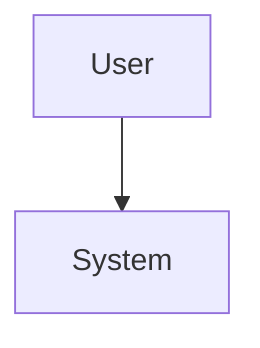

## Overview

Describe the project in plain language. What was the goal? What kind of user or team was it for?

## Product goals

* Goal one
* Goal two
* Goal three

## Interface or system direction

### What mattered most

Explain the important tradeoffs or design constraints.

### Technical notes

Describe the stack only after the reader understands the product intent.

## Supported markdown and embed syntax

Project detail pages support the same rich markdown renderer as blog posts, including:

- headings `#` to `######`
- bold / italic / bold+italic / strikethrough / highlight
- inline code and fenced code blocks
- syntax-highlighted code fences
- bullet lists, ordered lists, nested lists, task lists
- links, reference links, auto URLs
- tables and aligned tables
- blockquotes and horizontal rules
- footnotes and definition lists
- math and Mermaid diagrams
- raw HTML like `<details>`
- Obsidian-style links and embeds
- images, PDFs, audio, and video embeds
- callouts such as `> [!note]`

### Quick examples

```markdown
**bold** *italic* ~~strike~~ ==mark==

- bullet
  - nested bullet

- [x] shipped
- [ ] follow-up

[External link](https://example.com)
[[Another Note|Alias]]


![[image.png|300]]

| Metric | Result |
|:-------|------:|
| Uptime | 99.9% |

> [!warning]
> Tradeoff to document
```

### Math

```markdown
$E = mc^2$

$$
a^2 + b^2 = c^2
$$
```

### Mermaid

````markdown

````

### Obsidian-style embeds

```markdown
![[Another Note]]
![[Another Note#Heading]]
![[Another Note#^blockID]]
![[file.pdf]]
![[audio.mp3]]
![[video.mp4]]
```

## Lessons

What became clearer after building it?

## Next steps

- [ ] Follow-up idea
- [ ] Follow-up idea
- [ ] Follow-up idea
